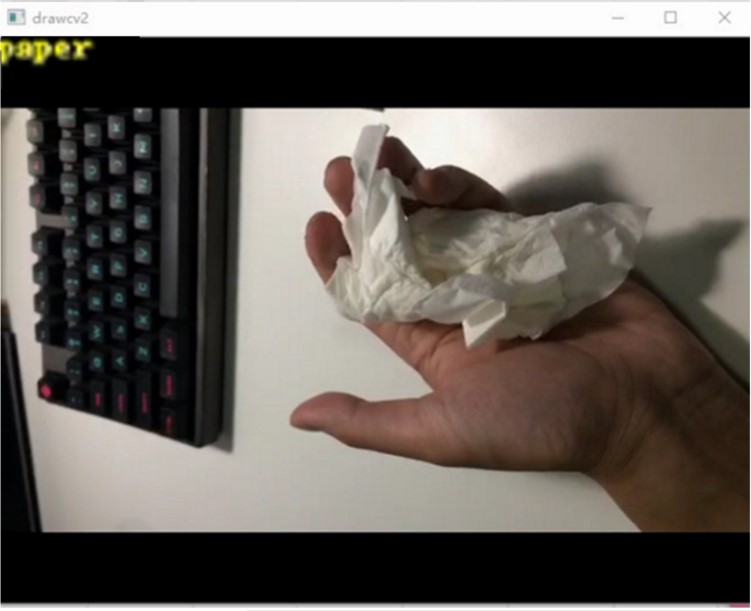
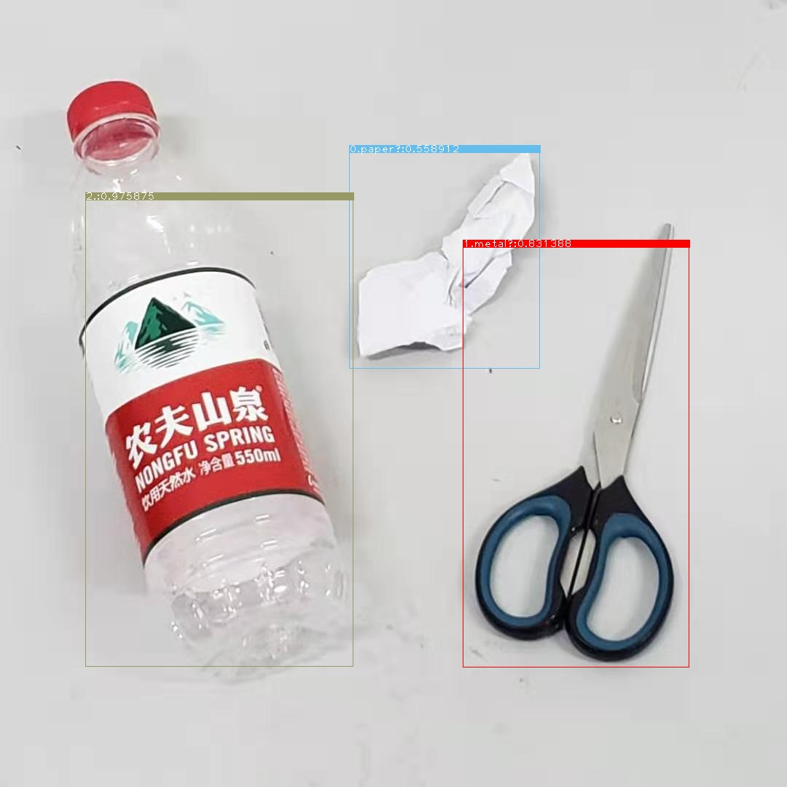
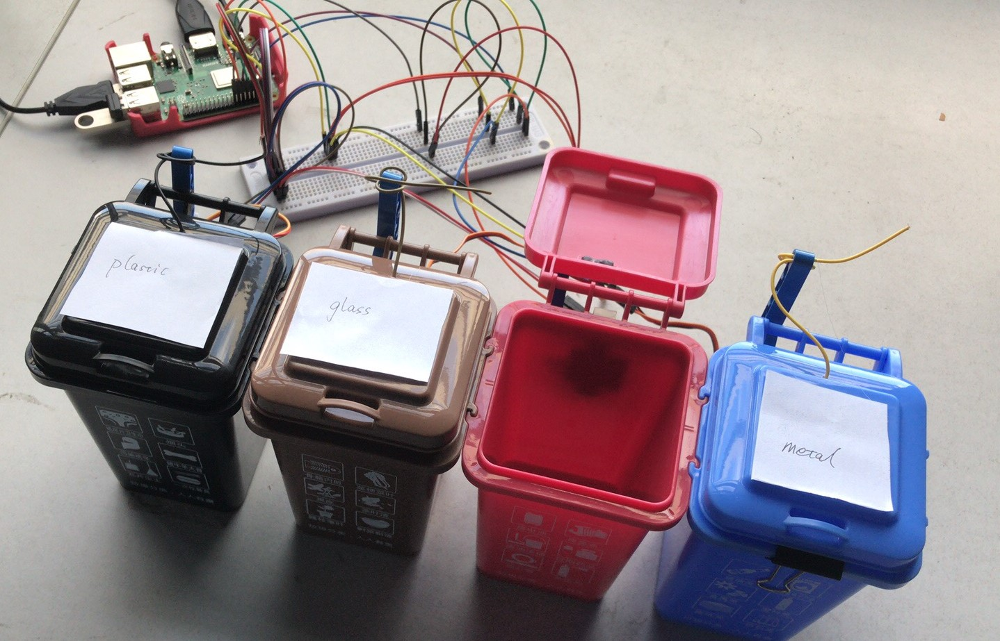
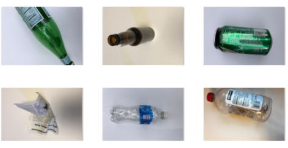
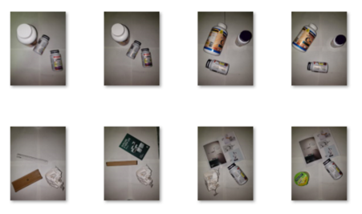

# 基于图像分类和目标识别的可回收垃圾分类机
运用PaddlePaddle 深度学习框架，构架了基
于MobilenetSSD 和ResNet50 深度神经网络
的边云协同模型，进行可回收垃圾的图像分
类和目标识别，图像分类识别准确度可以达
到 88%，目标识别准确度可以达到65%。

## 一、核心技术概括
- 图像分类：基于百度PaddlePaddle 深度学习框架构建综合
ResNet50 和迁移学习的垃圾分类模型。
- 目标识别：基于百度PaddlePaddle 深度学习框架构建
MobileNetSSD 实时可回收垃圾目标识别模型。
- 边缘计算：利用PaddleLite和模型优化压缩工具，将压缩模型部署在树莓派3B+，连接舵机，实现模型应用于硬件。
- 云端计算：利用花生壳和Flask将模型部署在远端主机，树莓派采集图像，主机接受图像返回结果，并连接，实现模型应用于硬件。

## 二、场景运用
- 分别在主机、嵌入式系统、移动设备上实现基于
百度PaddlePaddle 深度学习框架的可回收垃圾
自动分类、识别系统。
- 小区（社区）：智能垃圾桶，进行可回收垃圾的
自动分类。
- 垃圾场（收集站）：自动化流水线，进行可回收
垃圾的目标识别。

## 三、项目最终效果
**训练模型测试结果**
- 图像分类测试图


<div align="center"></div>

- 目标识别测试图

<div align="center"></div>


**压缩模型测试结果**
- 目标识别测试图
<div align="center"></div>

- 目标识别控制舵机

<div align="center"></div>

## 四、数据集介绍
- 本设计使用的，数据来源于斯坦福大学的可回收垃圾集（https://github.com/garythung/trashnet） 和自行调查拍摄的可回收垃圾集共同组成的数据集

1、图像分类
<div align="center">

| 编号 | 类别 | 数量 |  
|:----:|:----:|:---:|
| 1 | metal | 414 |
| 2 | glass | 508 |
| 3 | paper | 602 |
| 4 | plastic | 518 |

</div>
<div align="center"></div>


2、目标识别

<div align="center">

| 编号 | 类别 | 数量 |  
|--|--|--|
| 1 | metal | 414 |
| 2 | glass | 508 |
| 3 | paper | 602 |
| 4 | plastic | 518 |

</div>

<div align="center"></div>

##  五、超参数设置
- 图像分类：

迁移学习:

inputsize = 3,224,224

LearningRate = 0.0001

BatchSize = 16


训练:

inputsize = 3,224,224

LearningRate = 0.001

BatchSize = 32


- 目标识别：

inputsize = 3,300,300

LearningRate = 0.001

BatchSize = 32


## 六、训练及测试项目运行方式

### 1、模型训练与测试
- 配置要求

训练使用百度提供的AI Studio

| 编号 | 项目 | 配置 |  
|--|--|--|
| 1 | GPU | v100 |
| 2 | 显存 |  16GB|
| 3 | CPU | 8 |
| 4 | RAM | 32G |
| 5 | python | 3.5 |

a. ResNet50图像分类
 训练

进入Classification(ResNet50)目录
```
python3 train.py
```
 测试

```
python3 test_realtime.py
```
b. MobileNetSSD目标识别
进入Object Detection(SSD)目录
 训练

```
python3 train.py
```
 测试

```
python3 _ce.py
```
### 2、边缘计算（目前仅实现目标识别）
- 配置要求

| 编号 | 项目 | 配置 |  
|--|--|--|
| 1 | 树莓派 | 3B+ |
| 2 | 树莓派摄像头 |  usb摄像头|
| 3 | 操作系统 | 官方操作系统 |
| 4 | 舵机 | SP90 |
| 5 | cmake | 3.10 |

- 运行

关机状态将摄像头连上树莓派

将舵机通过杜邦线连树莓派引脚

将PaddleLite-armlinux-demo目录拷贝进树莓派

进入object_detection_demo目录


```
./r.sh
```
运行即可
### 3.伪云端（目前仅实现图像分类）
## 七、详细方案

### 1、模型训练与测试

### 2、边缘端部署与使用
步骤：

  1.将已有paddlepaddle训练模型使用paddlelite编译好的优化工具压缩（https://paddlepaddle.github.io/Paddle-Lite/v2.0.0/model_optimize_tool/），并获得naive buffer模型

  2.将新获得的naive buffer模型和自己任务的标签替换PaddleLite-Demo中的model和labels

  3.在树莓派中运行PaddleLite-Demo的脚本文件，获取运行得到的目标识别预测类别，并使用gpio将不同的类别与对应的引脚匹配上

| 编号 | 类别 | bcm编码引脚号 |  
|:--:|:--:|:--:|
| 1 | plastic | 27 |
| 2 | metal |  22|
| 3 | glass | 17 |
| 4 | paper | 4 |


  4.实现摄像头获取图片，将图片传输给模型得到预测类别反馈于舵机

图像分类

脚本目录：
```
image_classification_demo文件夹：图像分类模型部署
- images文件夹：中放置需要被读取并测试的图片
- labels文件夹：模型输出的标签
- models文件夹：存储用paddlepaddle训练输出后压缩的naive buffer图像分类模型
image_classification_demo.cc：执行压缩模型c++程序
run.sh：Linux脚本调用c++程序并指定运行场景（armv7hf为树莓派）
Paddle-Lite文件夹：c++程序所需要的动态库
```
目标识别

脚本目录：
```
进入object_detection_demo文件夹：图像分类模型部署
- images文件夹：中放置需要被读取并测试的图片
- labels文件夹：模型输出的标签
- models文件夹：存储用paddlepaddle训练输出后压缩的naive buffer目标识别模型模型
object_detection_demo.cc：执行压缩模型c++程序
run.sh：Linux脚本调用c++程序并指定运行场景（armv7hf为树莓派）
r.sh：获取摄像头抓拍图片，并执行run.sh脚本，获取类别标签，调用ppp.py文件控制舵机
ppp.py控制舵机
Paddle-Lite文件夹：c++程序所需要的动态库
```

最终成果：
<div align="center"></div>

### 3、云端部署与使用
1.	伪云端实现：

使用花生壳5，对本地IP实现内网穿透（IP地址及端口的映射），实现公网与内网的数据通信交互，与之后介绍的基于Flask的部署方式有关。

<div align="center"></div>


2.	服务器端模型部署：

根据这篇“手把手教你部署深度学习模型” https://www.jianshu.com/p/43da2553a2fb提供的思路，实现Paddle模型的部署。
目前，我们已经将在AI Studio上训练好的模型保存至本地，那么根据test.py中的代码，我们可以实现Paddle模型的“一次性推断”。其中，在Line 4导入的model1是由PaddlePaddle提供的残差神经网络ResNet模型库；Line 46中定义的read_image()方法中，需要手动添加一个等待预测的图片的相对路径或绝对路径。经过模型的计算，会将预测的类别存入变量lab中，并且输出。接下来，我们将“一次性推断”转换为“在线推理”。计划是将这些代码包装在Flask应用程序中。Flask是一个非常轻量级的Python Web框架，它允许您用最少的工作来创建一个HTTP API服务器。根据server.py代码，我们可以实现“在线推理”。其实从本质上来说，无论是图片还是文字或者字符，都是数据，即最原始的一串0和1组成的二进制数据，API接收或者返回图片，本质上也就是接收或返回一段数据流。
向服务器发送一张图片的方式，我们在下一个部分介绍。从服务器接收图片，我的做法是服务器端将通过base64将字节转化为图片。
将转化的图片保存到本地后，接下来进行推理的过程，与在本地进行“一次性推推断”是一致的。用Flask实现正是我们所需要的——Flask与PaddlePaddle是完全同步的，他们将按照接收到的顺序一次处理一个请求，并且可以将处理的结果返回给客户端。在最后一行的方法app.run("", port=)中，我们需要填写用花生壳5实现内网穿透的本地IP地址及端口号，完成路由注册。

3.客户端上传/接收实现：

向服务器发送图片，具体的实现步骤是：编写Python脚本，使用OpenCV读取摄像头，设置延迟3秒后拍一张照片，并将照片保存在本地；接着，以二进制的方式打开，将其转换为base64后添加的List型变量image中，再post给服务器。其中，Line 30中定义的方法requests.post(url,data=res)，第一个参数需要填写一个和服务器端相同的IP地址，由于我们利用花生壳5实现内网穿透，可以脱离局域网的限制，可以利用公网IP与服务器实现通信，因此，这个参数url可以填写花生壳5提供的域名及端口号。

经过服务器的处理，会将推理生成的Label值以byte型变量传回客户端，具体可参考Line31，32代码实现的过程，利用str()强制类型转换成str型的label后，根据判断调用树莓派GPIO的指定端口，实现舵机的运作。
